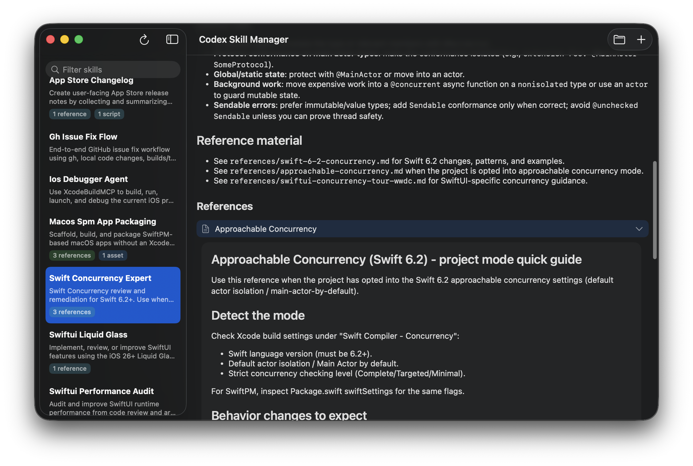

# Codex Skill Manager



Codex Skill Manager is a macOS SwiftUI app built with SwiftPM (no Xcode project). It lists your local Codex skills, renders each `SKILL.md`, and lets you browse remote skills from Clawdhub.

## Features
- Browse local skills from `~/.codex/skills/public`
- Render `SKILL.md` with Markdown, plus inline reference previews
- Import skills from a folder or zip
- Delete skills from the sidebar
- Browse Clawdhub skills with search + latest drops
- Download remote skills into your local Codex folder
- Show Clawdhub author info in the detail view
- Visual tags for installed status and versions

## Requirements
- macOS 26+
- Swift 6.2+

## Build and run
```
swift build
swift run CodexSkillManager
```

## Package a local app
```
./Scripts/compile_and_run.sh
```

## Credits
- Markdown rendering via https://github.com/gonzalezreal/swift-markdown-ui
- Remote skill catalog via https://clawdhub.com
